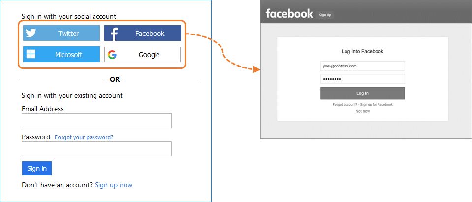

In this module we will show you some examples how to customize a policy.

## Customizing and localize the UX
### Customize the UI using HTML templates
With Azure AD B2C, you get nearly full control of the HTML and CSS content that's presented to users. See this article how to use a [custom HTML template](https://docs.microsoft.com/en-us/azure/active-directory-b2c/active-directory-b2c-ui-customization-custom) 

### Adding JavaScript to your HTML page
1. Set the [page contract](https://docs.microsoft.com/en-us/azure/active-directory-b2c/page-contract). Replace **all** of the content definitions (that defines in the base policy) with the respective page contract. See the table in this article
1. In your relying party policies add the allow script element, and follow the guidance on how to use JavaScript. Read more [here](https://docs.microsoft.com/en-us/azure/active-directory-b2c/javascript-samples#add-the-scriptexecution-element).
1. You can now embed JavaScript in the HTML page. 

### Localization
Language customization in Azure AD B2C allows your user flow to accommodate different languages to suit your customer needs. Microsoft provides the translations for 36 languages, but you can also provide your own translations for any language. Even if your experience is provided for only a single language, you can customize any text on the pages. 

Localization includes two parts:
1. Localize the Azure AD B2C labels and claims. So, you can customize the each label on the screen, such as the continue button, or the display name of a claim. Read the [localize document](https://docs.microsoft.com/en-us/azure/active-directory-b2c/localization) for more details.
1. In some cases you may want to render different HTML content based on the current language. To do so, you need to pass the language Id to your HTML page. 
    1. Static HTML page - TBD
    1. Dynamic HTML page -TBD 

### Adding or removing claims from the page
To add claims to the page, see the next section. 
To remove a claim - TBD

## Extend the user profile
The starter pack policy comes with a set of claims (or attributes), such as display name, first name, last name and email address. You may want to extend the user profile and manage more information about the user. For example if you may like the user profile to contain following information: Country of residence, city name, preferred language etc. 

To do so, you first need to declare the claim. If the claim is not a built-in one (such as `city`, `mobile`, and `title`), the name of the claim must start with `extension_`. Add the claim to each of the following technical profiles:

|Technical profile  |Action | Element  |Description  |
|---------|---------|---------|---------|
|AAD-UserReadUsingObjectId     | Read |  OutputClaim        | Read the data for local account        |
|AAD-UserReadUsingAlternativeSecurityId-NoError     |Read | OutputClaim         | Read the data for social account        | 
|LocalAccountSignUpWithLogonEmail     |Collect |  OutputClaim        | Collect the data from user during sign-up with local account        |
|SelfAsserted-Social     | Collect |OutputClaim        |Collect the data from user during first time sign-in with social account         |
|SelfAsserted-ProfileUpdate     | Collect |InputClaim and OutputClaim        | Collect the data from user during edit profile. In this technical profile you need to set the input claims as well, so Azure AD B2C will prefilled the claims and present them to the user.        |
|AAD-UserWriteUsingLogonEmail     | Write| PersistedClaim         | Persist the data during sign-up with local account        |
|AAD-UserWriteUsingAlternativeSecurityId     | Write| PersistedClaim        | Persist the data, during first time sign-in with social account        |
|AAD-UserWriteProfileUsingObjectId     | Write| PersistedClaim        | Persist the data, during profile editing        |
|Relying party     |Return|   OutputClaim       |  Set the claims to be return to your relying party application.       |

## Add a federated external identity provider
You can configure Azure AD B2C to allow users to sign-in to your application with credentials from an external identity provider, such as Facebook, Microsoft account, Google, Twitter, or any identity provider that supports OAuth1, OAuth2, OpenID Connect, SAML, and Ws-Fed protocols. 

On the sign-up or sign-in page, Azure AD B2C presents a list of external identity providers a user can choose to sign-in with. Once the user clicks on one of the external identity providers, the user is taken (redirected) to the selected identity to complete the sign-in. After the user has successfully signed-in, the user is returned back to Azure AD B2C. Azure AD B2C creates the new social account into the directory, or reads an existing external account profile from the directory and returns the id token to the application.

Adding external identity providers to your policy varies based on the protocol used, whether it's OAuth1, OAuth2, OpenID Connect, SAML or WS-Fed. In most cases, this involves following steps:
1. Configure the identity provider. For example, for an OAuth2 identity provider, you need to create an application registration at the identity provider and set the return URI to Azure AD B2C endpoint.
1. Get the corresponding data from the external identity provider. For example, when federating with an OAuth2 identity provider, you need access to the Application Id, and Application secret. You will use those values in the next step.
1. Create an Azure AD B2C policy key to store the Application secret.
1. Configure a claims provider. To federate with your external identity provider, you need to configure a new technical profile to represent your trust relationship with the identity provider. 
1. Configure the technical profile with the relevant data in respect to your external identity provider.
1. Add the sign-in button and configure the action on click, which will point to the technical profile you added to you policy earlier.

