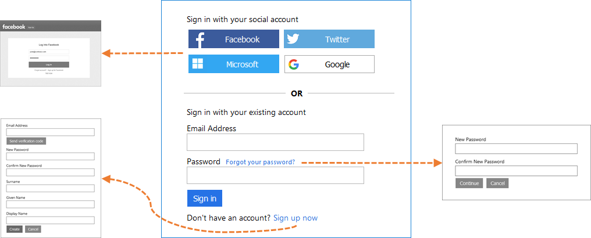
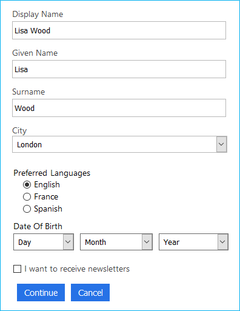
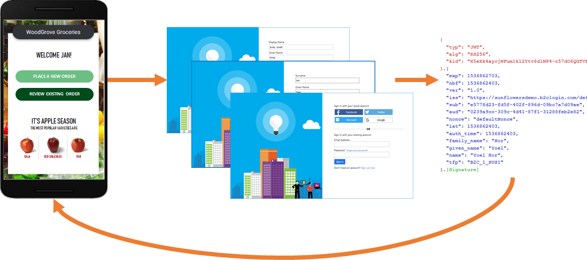

# Introduction to Azure AD B2C custom policies

In this training we will be taking a closer look at what Azure AD B2C custom policies are. Many times when "custom policies" are mentioned, we are referring to the underlying policy within Identity Experience Framework (IEF). The following will describe what an Azure AD B2C policy is comprised of and how a user experience is generated.

For consumer-based applications, there is a notion of sign-up, sign-in, profile management and even password reset. Azure AD B2C makes this easy across all platforms, web, mobile and desktop apps. Your customers have the flexibility to choose their identity:

- **Social accounts** such as Facebook, Microsoft, Google, Amazon or any other social identify provider. 
- **Enterprise accounts** such as ADFS or Salesforce.
- **Local account** where the account is stored and manage by Azure AD B2C.

## Azure AD B2C Policy
A policy, whether it’s a built-in policy or a custom policy, holds the same underlying concepts. Configuring a set of steps and user experiences to take the user through a journey to retrieve claims that are ultimately presented to the relying party application. 

Sign-up or sign-in is a common consumer enrollment experience.  These types of experiences are controlled by different policies.

Our first policy example is "Sign-up or sign-in". Using a sign-up or sign-in policy, users can: sign-in with a local account. Or sign-in with any external account, such as Facebook or ADFS. Create new local account. Or reset their password. All those actions are configured in the policy. 

Maintaining a user's information is important.  Utilizing the "Edit profile" policy will allow your users to maintain their information after successfully signing in with a social, local or external account.

With Azure AD B2C custom policies, you are not limited to the sign-up or sign-in, password reset and edit profile policies/journeys. You can create any policy you would like. Such as:   

- Link and unlink a social account to local or vice versa. 
- Allow a user to change their sign-in email address, or MFA phone number. 
- Invite a user to Azure AD B2C. 
- ROPC based flows - A non-interactive flow, commonly used with mobile applications. 
- Magic link - Where users can redeem an account with a link you send them, or launch any custom user journey.
- Sign in and migrate accounts - Allows you to migrate user accounts from any legacy identity provider to Azure AD B2C just in time.

## App integration
Your application, regardless if it is a web, mobile, desktop or single page application, initiates an authentication request referencing a policy id, such that a specific policy can be executed. The policy controls what the experience will be for this scenario.  The policy generates a token at the end of its execution, and it will be sent to your application to be consumed. This flow applies to any Azure AD B2C policy. 

The steps inside a policy can vary from policy to policy. It is truly based on set of steps you specify.
 
 
