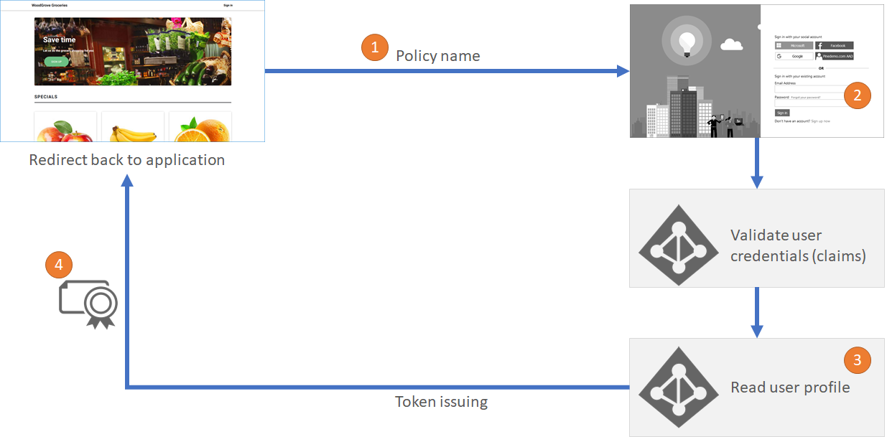
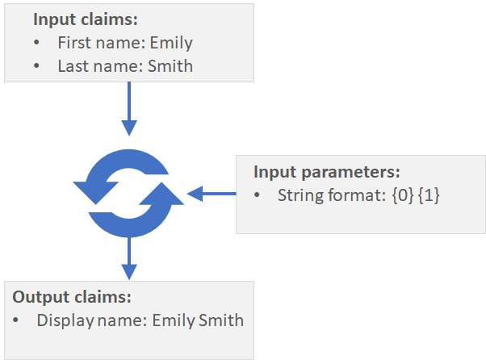

Azure AD B2C is backed by a global, highly available, and secure **cloud identity service** and **directory service**. During policy execution, such as sign-up or sign-in, Azure AD B2C policy exchanges claims with a variety of systems, both having the ability to send and receive claims in either direction.

## Sign-in with local account flow
This diagram depicts the Sign-in with local account flow using a "sign-up or sign-in" policy. 

1. The user starts their journey by opening their application and clicking on sign-in button. The user is redirected to Azure AD B2C to complete the sign-up or sign-in flow. 

1. In this example, the user chooses to sign-in with a local account (an account that is fully managed by Azure AD B2C). 
The user provides their email and password. Internally, the email address is cross referenced against the signInNames user attribute.

1. The user clicks "Sign In". Azure AD B2C validates the credentials provided by the user. If the user provided the correct credentials, Azure AD B2C reads various user object properties from the directory, such as display name, first name, last name and more. 

1. Azure AD B2C finally redirects the user back to the application with a token that was issued. 

At a high level, this outlines the flow of a local account sign-in journey. In these steps, Azure AD B2C exchanges claims with other systems.  

**First step**, the application sends information to execute the authorization request, such as the Azure AD B2C policy Id.  

**Second step**, the user provided their credentials, this translates to the "username" and "password" claims being provided by the user. This is a claims exchange, and this claims exchange is called "self-asserted".  

**Third step**, Azure AD B2C reads the user object from the directory. Sending the username claim and getting back the requested claims about the user.  

**Fourth step**, Azure AD B2C builds the id token and sends it back to the application.

## Sign-in with social account flow
In a more complex scenario, when a user chooses to sign-in with a Facebook account. The user is taken to the Facebook sign-in page. After the user completes their login to Facebook a token is returned to Azure AD B2C. Azure AD B2C validates the Facebook token and reads the claims. Then reads the social account profile from the directory.  

But, in this case Azure AD B2C also invokes a REST API, to further integrate with a marketing database, sending and receiving claims from the REST API. 

In the final step B2C issues an id token back to the application.

## Claims Exchange

Let’s take a closer look at following diagram which illustrates how Azure AD B2C exchanges claims with other systems. 

The relying party application, also known as your Application, sends an authentication request to B2C. B2C may send or receive claims from the end-user, social identity provider, multi-factor authentication provider, REST API and with the Directory service (Azure AD). 

During the policy execution, Azure AD B2C stores the claims in a temporary memory called a "claims bag". This is stored in real-time to be utilized for any further steps in the policy. 

## Claims Definitions
A claim provides temporary storage of data during an Azure AD B2C policy execution. It can store information about the user, such as first name, last name, or any other claim obtained from the user or other systems (claims exchanges).  

When the policy runs, Azure AD B2C sends and receives claims to and from internal and external parties and then sends a sub-set of these claims to your relying party application as part of the token. Claims are used in these ways: 
- A claim is saved, read, or updated against the directory user object.
- A claim is received from an external identity provider.
 - Claims are sent or received using a custom REST API service.
 - Data is collected as claims from the user during the sign-up or edit profile flows.

A claim should have at least following 

- **Id** - an identifier that's used for the claim type. Other elements can use this identifier in the policy.
- **Display name** - The title that's displayed to users on various screens. The value can be localized.
- **Data type** - The type of the claim. Data types such as Boolean, date, date and time, int, long, string, string collection, and more.

If a claim is used as part of a page a user can interact with (self-asserted claims exchange), the claim may contain more information, such as: 
- **User input type** - The type of input control that should be available to the user when manually entering the claim data for the claim type, for example "text box". See the user input types defined later on this page.
- **Mask** - An optional string of masking characters that can be applied when displaying the claim. For example, the phone number 324-232-4343 can be masked as XXX-XXX-4343.
- **User help text** - a description of the claim type that can be helpful for users to understand its purpose. The value can be localized.
- **Restriction** - The input validations for this claim, such as a regular expression (Regex) or a list of acceptable values. The value can be localized.
- **Predicate validation reference** - A reference to a predicate validations input element, that allows you to perform a validation process to ensure that only properly formed data is entered. For more information, see Predicates.

## Claims mapping and default value
When Azure AD B2C exchanges claims, the name of the claim used by the partner _may_ differ from the one configured in your policy. For example, Azure AD B2C refers to the first name with **givenName** while Facebook uses **first_name**. Azure AD B2C supports mapping your partner claim name to the one configured in your Azure AD B2C policy.

In the table below, we can see how various entities give different claim names to the same property.

|B2C internal name  |Facebook  |Google  |Twitter  |
|---------|---------|---------|---------|
|issuerUserId     |id         | id        | user_id        |
|givenName     | first_name         | given_name        |  NA       |
|surname     | last_name        | family_name        |  NA       |
|displayName     | name        |  name       | screen_name        |
|email     |   -      |   -      |     -    | 

You can use claims mappings to change the name of the claim while sending and receiving data from any claims exchange component. This allows you to be able to interface your Azure AD B2C claim IDs with those of external systems.

You may want to set a default value to a claim, if the partner doesn’t return the claim, or to override the value regardless of the returned value, or to handle null return values.  
An example of this is setting the claim called `identityProvider` to `facebook.com` and the `authenticationSource` to `socialIdpAuthentication`. Subsequent steps in the policy can then use these claims to check whether user sign-in with a local account, or social and take a conditional based action.

<!--|Claim  |Facebook  |Google  |Twitter  |
|---------|---------|---------|---------|
|identityProvider     |facebook.com      | google.com        | twitter.com        |
|authenticationSource     | socialIdpAuthentication        |  socialIdpAuthentication       |  socialIdpAuthentication       |-->

## Claims transformations
Claims transformations are predefined functions. When exchanging claims with a partner, you may need to convert a given claim to another one or determine whether one claim is equal to another. Azure AD B2C has a predefined set of claims transforms which allows manipulating the claims inside the claims bag.

Here are some examples of claims transformations:
- Change a string case to upper or lower case
- Set a predefined value to a claim
- Compare two claims and return a boolean result
- Create a random string
- Format a string by the way of concatenation
- Add a claim to a string collection
- Get current data and time
- Null a claim 
- Check if a claim has value and return a boolean result

 

