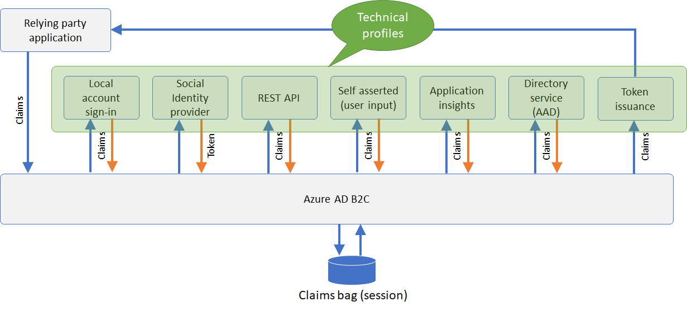
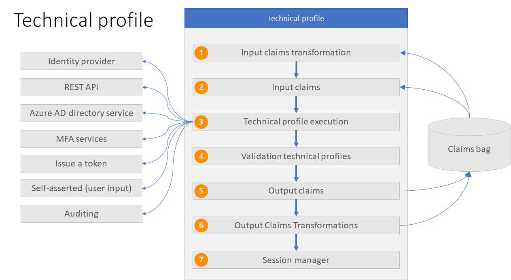
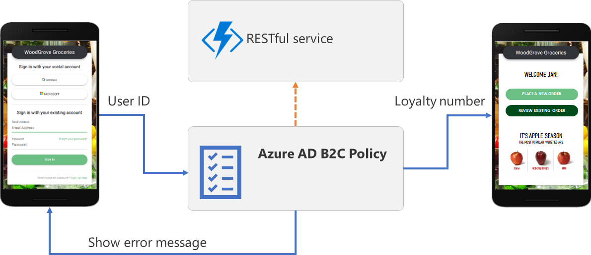

The following will dive into the underlying components of Azure AD B2C, these components are referred to as Technical Profiles which drive the functionality of your Azure AD B2C policy. All interactions with partners to perform claims exchanges are completed via technical profiles. 

You can think of Technical Profiles like functions. They can: 
- Send claims to the partner - "input claims"
- Execute a procedure - E.g. Render a page to collect information from the user
- Return claims to Azure AD B2C – "output claims" 

Technical profiles provide a framework with a built-in mechanism to communicate with known Azure AD B2C components, REST APIs and Identity Providers via open standard protocols. <!--: OAuth1, OAuth2, OpenID Connect, SAML and Ws-Fed. Or Communicate with B2C parties, using internal B2C protocols for: Azure Active Directory, Phone factor provider, Self-asserted, Restful provider, Session management, Token issuer and many more.-->

There are various types of technical profile:
- Identity Provider - Denoted by the Protocol of the Identity Provider (OAuth1, OAuth2, OpenID Connect, SAML and Ws-Fed)
- REST API - Allows interfacing with an external API
- Self-Asserted - Allows presenting a page to the user
- Azure MFA - Allows presenting the Azure MFA screen to a user.
- Azure Active Directory - Allows Read/Write operations against the directory
- Application Insights - Allows sending custom events to an App Insights instance.
- Token Issuer - Allows issuing a token after authentication completes.

All types of technical profiles share the same concept as per the following diagram. <!--Azure AD B2C reads claims from the claims bag, sends input claims, run claims transformation, and communicate with the configured party, such as an identity provider, REST API, or Azure AD directory services.  After the process finishes, the technical profile returns the output claims and may run output claims transformation. Regardless of the party the technical profile interacts with, after any claims transformation is executed, the output claims from the technical profile are immediately stored in the claims bag.-->

<!--If broken down in each one of the components, you can see there are 7 primary steps in order to create a session. This diagram shows how a technical profile is processed. Regardless of which type of technical profile selected, after any technical profile is executed, the output claims from the technical profile are immediately stored in the claims bag. Let’s quickly walk through the steps:
-->
1. **Input claims transformation** - Before a claim is provided to this Technical Profile, the claim can be manipulated via a claims transform. For example, concatenate two claims and provide it as an input claim to this technical profile.

2. **Input claims** - Claims that are provided as inputs to the type of Technical Profile being executed. Since each type of Technical Profile provides its own built in functionality, these input claims can act differently.  
    - Self Asserted - Pre-populate fields that are displayed on the screen.
    - REST API - Act as claims to be sent as a JSON key value pair to the API endpoint.
    - Identity Provider (OpenId) - Additional query parameters as part of the authentication request.
    - Azure MFA - Pre-populate the phone number for an prior enrolled user.
    - Azure Active Directory - To lookup the user in the directory. 

<!--For some of the technical profile you need to specify the set of input claims. For example, when calling a REST API, use input claims to specify the list of claims to be sent to the REST service. When collection information from the user, use input claims to pre-filled the claims on the screed (commonly used in edit profile policy). When reading, or updating a user profile, use input claim to specify the user unique id, such as user objectId, sign-in name, or user principle name.-->

3. **Technical profile execution** - As each Technical Profile has a type, the execution is dependant on that.
    - Self Asserted - Display a page for the user to interact with. The user can provide information, or edit information about their profile.
    - REST API - Ability to call a REST API endpoint to exchange claims.
    - Identity Provider - Ability to redirect the user to an external Identity Provider.
    - Azure MFA - Provides the user a page to perform Azure MFA.
    - Azure Active Directory - Allows Azure AD B2C policy to read or write to the directory.

<!--The technical profile executes the procedure. For example: Take the user to a social identity provider to complete the sign-in. After successful sign-in, the user returns back to B2C and the technical profile execution continues, to the next step. A technical profile can call a REST API while sending parameters as Input claims and getting information back as output claims. Create or update the user account, or send and verifies the MFA text message.-->

4. **Validation technical profile** - When a user provides data via a Self-Asserted technical profile, this information may need to be validated. A common example is to have the user provide a loyalty number, which is then validated at an external system to determine if it is valid.

    A Self-Asserted technical profile can therefore call another Technical Profile, or multiple consecutively, which provide the means to validate the information.

    This will either allow the user to continue or prevent any further execution if an error is thrown. In the case where the user can continue, the validation technical profile can output claims and add them to the claims bag for any subsequent validation technical profiles to run as part of the this Self-Asserted technical profile.

    Claims that a Validation technical profile shared (output) with the Self-Asserted technical profile are not automatically available for subsequent steps in the Azure AD B2C policy to use, unless those claims are output within the Self-Asserted technical profile itself.

    In the example of validating a loyalty number, the Validation technical profile can reference a REST API technical profile to have the loyalty number validated at an external system.

<!--For a self-asserted technical profile, you can call an input validation technical profile. The validation technical profile validates the data provided by the user and returns an error message or not, with or without output claims. For example, when user sign-in with local account, B2C call a validation technical profile to validate the credential. Before Azure AD B2C creates a new account, it checks whether the user already exists in the directory services. 

    Also you can configure input validation on the claim level, using restrictions and preconditions. A claims checks the format or data range. With validation technical profile you can  call a REST API technical profile, adding your own business logic to the policy.-->

5. **Output claims** - Claims to return back to the claims bag. Depending on the technical profile type, the output claims behave differently, however all types of Technical Profile will return the output claim into the claims bag.
    - Self Asserted - Will display the fields to the user, unless satisfied by a Validation technical profile.
    - REST API - The expected JSON key value pairs from the APIs response.
    - Identity Provider - The expected JSON key value pairs from the JWT received.
    - Azure MFA - The ability to confirm the SMS/Phone Number completed MFA.
    - Azure Active Directory - Issues claims after reading or writing to a user into the claims bag.

    You can use these claims as input claims into subsequent orchestration steps, create conditional logic around the journey execution, or manipulate them via output claims transformations as part of this technical profile.

1. **Output claims transformations** - A technical profile may contain a list of output claims transformations to be executed to manipulate the claims before sending them to the claims bag. 

    As an example, take the first name and last name and use an output claims transformation to concatenate these values into a new single claim value. Subsequent steps will then be able to have access to the concatenated string.

<!--For example when sign-in with Facebook account, the technical profile who communicates with Facebook, reads the Facebook user unique identifier and run some claims transformation to create a B2C user principle name and also B2C social account unique identifier, which is a combination of the user id and Facebook provider name-->

7. **Session management** - A technical profile can contain a reference to a session management technical profile that is responsible to manage whether the user will skip a step in the policy when experiencing single sign on.

## Validation technical profile
As mentioned above, a Self-Asserted technical profile may define one or more validation technical profiles to be used for validating some or all of its output claims. 

A validation technical profile is an ordinary technical profile from any type(protocol), such as Azure Active Directory or a REST API. The Validation technical profile returns output claims or returns an HTTP error message. <!--The call to the REST API is done from Azure AD B2C server, and you can secure the comunication.-->

The most common use of a Validation technical profile is to validate the username and password the user provides during **Sign-In**.

Another example during **Sign-up**, before allowing a user to create their account, Azure AD B2C must check if the account already exists. 

Therefore, once the user enters their information through a Self-Asserted technical profile, it must validate the email does not already exist in the directory.

To achieve this, the Self-Asserted technical profile calls a Validation Technical profile which searches the directory for the users email. An Azure Active Directory technical profile type is used, which is configured to throw an error if the user exists, or otherwise continue silently.

You can further augment this process to call another Validation technical profile of type REST API. This could validate any other information the user provided during sign up, for example their ID Number.

<!--B2C invokes a validation technical profile to check if the account already exists. If no, create the account and return the user object id. You can add additional validation technical profiles to check if a user exists in your database, or update your system when a user change the profile.-->

## Integration with line of business applications
You can use REST API technical profile to:
- **Validate user input data** - This action prevents invalid data from being persisted into Azure AD B2C claims bag. If the value from the user is not valid, your RESTful service should return an error message that instructs the user to provide a valid entry. For example, you can verify that the email address provided by the user exists in your CRM platform.
- **Overwrite input claims**  - For example, if a user enters the first name in all lowercase or all uppercase letters, you can format the name with only the first letter capitalized.
- **Enrich user data by further integrating with corporate line-of-business services** - Your RESTful service can receive the user's email address, query the CRM platform, and return the user's loyalty number to Azure AD B2C. The return claims can be stored in the user's Azure AD account, evaluated in the next Orchestration Steps, included in the id token or a combination.
- **Run custom business logic** - You can send push notifications, update corporate databases, run a user migration process, manage permissions, audit databases, and perform other actions.

 

